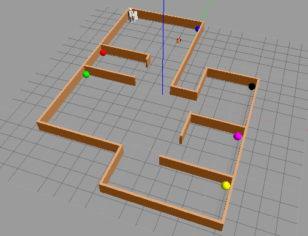
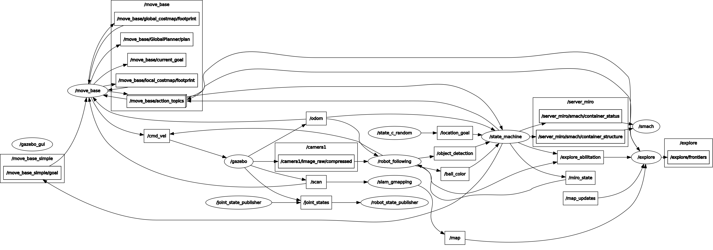
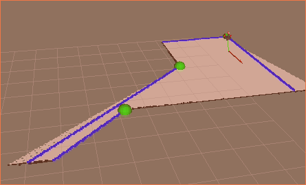
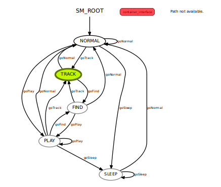
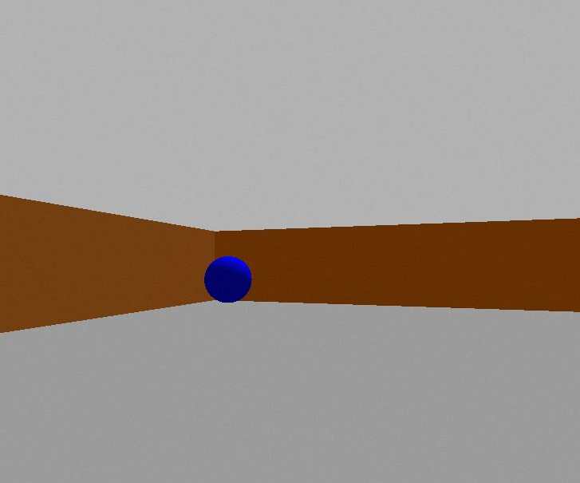
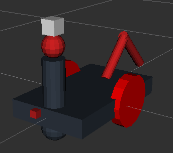

# Experimental Robotics Laboratory - Assignment 3
## Riccardo Lastrico - 4070551

### Assignment contents 

The assignment content is an exercise based on ROS about a finite state machine that represent a pet-like robot behavior; this robot moves in a 3D simulation using Gazebo and is equipped with an RGB camera. Using that camera, is able to recognize different balls of different colors; each ball is associated to a different room and when it is first seen its position is associated to the correspondent room. The robot can navigate around the ambient and find the ball and, when requested, is able to go back to a precise room that has been previously discovered.

#### Map of the environment 
The ambient is devided in rooms, each room has inside a ball of a particular color:

- Entrance, blue;
- Closet, red;
- Living room, green;
- Kitchen, yellow;
- Bathroom, magenta;
- Bedroom, black.

### System architecture

This is a graph of the system architecture (obtained via rqt-graph):

#####  Implemented nodes

The node <code>state_miro</code> contains the state machine that will be described right after this paragraph.

The node <code>state_c</code> (or <code>state_c_random</code>) sends commands to the state machine; a successful "PLAY" command will make the robot go to the human position and then a location command will succeed; the robot wait for some time for the instruction to which location to go, if that is not received it will go back wandering in the map.

The node <code>robot_following</code> receives the image from the camera and if detects a ball sends a message to the <code>state_miro</code> node; when the state machine will change state, this node will also send <code>cmd_vel</code> messages to the robot depending on the distance from the ball.

`move_base`, this node will allow to navigate in the map to a given xy coordinate, using a global and a local planner for the navigation.

`explore`, this node allows to map the ambient, navigation towards unexplored frontier of the visible map.

The node `slam_gmapping` takes informations about the physical obstacles in front of the robot using the Lidar sensor; those data will be used to build the map of the ambient.

Snapshot of the map while it is being built(obtaned via rviz):

### System states

This is a graph of the possible states (obtained via smach-viewer):

The possible states are: 
<ul>
<li><code>SLEEP</code>, the robot is sleeping and so it wont respond to any command. After a while in the <code>NORMAL</code>, <code>FIND</code> or <code>PLAY</code> state, even if not commanded to do so, it reaches location [-5, 4]. After some amount of time, the robot goes again in state <code>NORMAL</code>. </li>
<li><code>NORMAL</code>, the robot is in the predefined state, it moves around the map until he detects a ball in his lane of sight: the robot will than pass to the <code>TRACK</code> state. This behavior is driven by the <code>explore_lite</code> package until the complete map has been reconstructed and all the ball has been found, then some target coordinates are radomly generated. If the robot receives a  <code>goPlay command</code> it will switch to the  <code>PLAY</code> state.</li>

<li><code>PLAY</code>, the robot enters in this state from the <code>NORMAL</code> one receiving a command. It starts to approach the human, unless it receive a location command (to avoid loosing to much time in waiting the robot to reach him), and when it has gone near him it awaits for a location command. If the location's position is known than the robot will reach that position, otherwhise it will go to the  <code>FIND</code> state. When the location is found or reach it will go back to this state, the robot will approach again the human and the behavior resets. If a location command is not given, after some time the robot will reset to the <code>NORMAL</code> state.

</li>

<li><code>TRACK</code>, the robot enters this state from the <code>NORMAL </code> or the <code>FIND</code> state. It stops the exploration performed with the <code>explore_lite</code> package and it approaches the ball, saving its location. After that, it will go back to the previous state.

</li>
<li><code>FIND</code>, the robot enters this state from <code>PLAY</code>, it abilitates the <code>explore_lite</code> driven exploration and it starts to find the ball related to a precise location. The behavior is very similar to the <code>NORMAL</code> state, the only difference is that this state stops when the particular ball has been found, going back to the <code>PLAY</code> state, (if he finds other colors they will be saved but the search process won't be interrupted) or if it goes in timeout, than it will go back to the <code>NORMAL</code> state.

</li>

</ul>

#####  Packages and file list

The package containing the assignment is <code>exp_assignment3</code>, in addition we have `gmapping` and `explore_lite`.
In particular, we have:

 - `scripts` folder:
     - `robot_following3.py`: contains the code `image_feature`, this node perform the blob detection on the image from the camera and if the robot is in the `TRACK` state also sends `cmd_vel` commands to the robot to approach a ball in front of it; it also advises the state machine if a ball with unknown position has been detected.
	 - `state_machine_miro_ext.py`: the smach state machine of the robot;
	 - `state_c.py`: gui application to send commands to the robot;
	 - `state_c_random.py`: node that radomly sends commands to the robot;
 - `launch` folder:
     - `display.launch`: launch file that launches Rviz to check the model of the robot;
     - `sim_controlled.launch`: launches the simulation where commands are received from the user;
     - `sim_random.launch`: launches the simulation where commands are generated randomly;
	 - `gmapping.launch`: launches the mapping procedure;
	 - `move_base.launch`: launches the node that allows the trajectory planning;
     - `simulation.launch`: launches the simulation, it is not to be called directly.

### Installation 

This is a ROS package, so it will be necessary to clone this repository into the <code>src</code> folder of a ROS workspace (here is assumed to be named <code>my_ros</code>):
    
	
    cd ~/my_ros/src
    git clone
    catkin_make --pkg explore_lite
    

    
Some packages are needed:

    smach-viewer
    cv_bridge
    image_transport
    move_base
	explore_lite (modified version, provided)
	gmapping (provided)
	

### Run the simulation 

To easily run the simulation i created a launch file, that can be used this way:

    
    source ~/my_ros/devel/setup.bash 
    roslaunch exp_assignment3 sim_random.launch

This runs the random simulation, the state of the robot will be outputted on the shell with the information about the command received and an eventual change of state; unfortunately, due to the implementation of the packages `explore_lite` and `move_base` the output is very cluttered.

If you want to interact with the simulation by giving direct commands you have to run:
    
    source ~/my_ros/devel/setup.bash 
    roslaunch exp_assignment3 sim_controlled.launch

and then open a new shell and run:

    source ~/my_ros/devel/setup.bash 
    rosrun exp_assignment3 state_c.py
	
A command line interface allows to send commands to make the robot go in the `PLAY` state and to receive commands about which location to reach.

For both, an additional window will open: this contains the output image from the robot's camera:

### System features 

The system features a finite-state machine using the <code>Smach</code> packet and a simulation done via Gazebo. The robot, using "color blob recognition", is able to recognize a ball in the image provied by the camera; the robot itself features the camera, two actuated joints (the wheels) and an additional one, the neck, that can be moved around the roll axis. 
The system also features the possibility to be controlled by the user or behave fully randomly, by writing the coordinates in the appropriate topic.
The system have mapping features: using a LIDAR sensor, is able to map the ambient and then be able to navigate into it. The mapping is done in conjunction with the `explore_lite` package, that contains an algorithm that devides the areas to be mapped into frontiers and tries to optimize the mapping process. The mapping in according with the colored-ball recognition feature, will allow to map the ambient and collect information about the actual position of the room, associating it with the correspondent ball.
After the mapping process, the robot is then able to navigate and, when the ball are recognized, to be able to reach a particular room if asked so.

The robot features an RGB camera and a Hokuyo Lidar sensor; i set the same field of view (90°) for both devices, this allows me to be sure that the mapping and the ball find process progresses together.
In addition, the robot has an unactuated caster wheel (just for stability) and two motorized fixed wheels, controlled via a differential wheel drive control system.
This is the robot:

### System limitation

Sometimes the `FIND` behavior is a bit slow to start, due to some momentaneous conflict with `explore_lite` and `move_base` and so is not able to find anything because it goes in timeout; this behavior is a bit random so i wasn't really able to understand why.
Depending on `explore_lite` and starting/stopping it when it necessary it looks like some time that node needs some time to generate a new goal location.
Sometimes, when entering in the PLAY state and reaching the human, the move_base node is not receiving the command fast enough (or it could have some interference with explore) so it behaves like it has already reached the human and it will wait still for a command.

### Possible improvements

It happens very rarely, but sometimes the robot will be stuck in a wall during the TRACK state, not being controlled by the planner; this could be avoided by introducing some kind of timeout to give the control back to the explorer or to ignore that ball for some time to make the robot going back to the NORMAL state (i added a little hack that might work).

The overall system generates a very high cpu load, so the simulation do not run at run time (being in a VM also do not help), maybe some optimization could be made, for instance reducing the image resolution or lowering the framerate. Always related to time, i often use a `time.wait()` function; in order to make the simulation more coherent, i might use a wait function that is related to the actual simulation time and not to the system time.

In my case i had to put the Lidar sensor a bit far off the robot model because otherwhise it wouldn't be able to properly detect the obstacles but detecting himself, a bit more study of the positioning could make it more elegant. 

In the random behavior, it may happen that in some transition (like reacnihg the human in PLAY or the SLEEP location) the robot might discover the area but not detect the ball, because in my architecture this is not allowed. If this happens, the ball could possibly not being found in the future, an improvement could be to add the possibility to be aware if a ball is in the field of view even in those cases.

### Documentation

The documentation is accessible in:

    ./doc/html/index.html

### Contacts

Riccardo Lastrico - 4070551

Email: riky.lastrico@gmail.com

